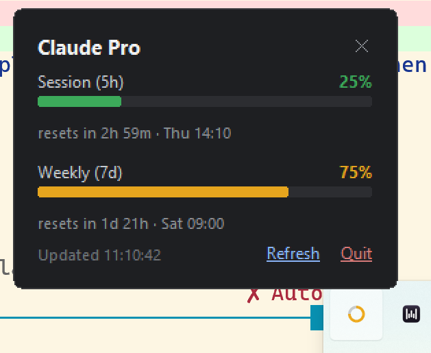

# Claude Usage Tray

A Windows 11 system tray icon (the same notification area as Spotify, Discord,
your battery, volume, etc.) that shows your **Claude** plan usage: how much of
your session/weekly limit you've used, and when it resets.




It reads the OAuth login that [Claude Code](https://claude.com/product/claude-code)
already stores on your machine after you sign in, and polls the same
usage endpoint Claude Code's own status line uses. No API key, no extra
login, no data leaves your machine except the request to Anthropic itself.

## What you get (v0.2)

- A ring-gauge tray icon, color-coded green → yellow → red as you approach
  your limit.
- **Click it — either button** (like OneDrive/battery/volume/network) to pop
  a small dark dashboard card above the tray with session (5h) and weekly
  (7d) usage bars, percent used, and countdowns to reset, plus Refresh and
  Quit links. Click again, press Esc, or click elsewhere to dismiss it.
  (Win32 tray context menus can't be styled at all, so there's no separate
  plain-text menu to click through first.)
- Hover it for a one-line tooltip summary.
- Auto-refreshes every 5 minutes in the background; "Refresh" forces one.

Not in yet: desktop notifications near the limit, historical charts,
non-Windows tray support. See [Roadmap](#roadmap).

## Requirements

- Windows 11 (Windows 10 should also work, untested).
- Python 3.10+.
- [Claude Code](https://claude.com/product/claude-code) installed and signed
  in at least once (`claude` → `/login`) — this tool reads the credentials
  it leaves behind at `~/.claude/.credentials.json`. A Claude Pro, Max, Team,
  or Enterprise plan (not a bare API key) is what exposes usage windows.

## Install & run

```powershell
git clone https://github.com/<you>/claude-usage-tool.git
cd claude-usage-tool
python -m venv .venv
.venv\Scripts\pip install -e .
.venv\Scripts\claude-usage-tray.exe
```

That last command launches the app with no console window — look for the
new icon in your system tray (bottom-right of the taskbar; click the `^`
arrow if it's hidden in the overflow list). Click it (either button) to
open the dashboard.

## Run it automatically at sign-in

Like Spotify or Discord, you'll usually want this running in the background
all the time rather than launching it by hand. A helper script adds a
shortcut to your Startup folder:

```powershell
powershell -ExecutionPolicy Bypass -File scripts\install-startup.ps1
```

Undo with:

```powershell
powershell -ExecutionPolicy Bypass -File scripts\install-startup.ps1 -Remove
```

(Or do it manually: press `Win+R`, type `shell:startup`, and drop in a
shortcut to `.venv\Scripts\claude-usage-tray.exe`.)

## How it works

Claude Code caches an OAuth access token locally after you log in. Its own
status line calls an unofficial endpoint,
`GET https://api.anthropic.com/api/oauth/usage`, with that token to render
session/weekly usage. This tool does the same thing on a background timer
and draws the result as a tray icon instead. See
[`src/claude_usage_tray/api.py`](src/claude_usage_tray/api.py).

This endpoint is **not officially documented or supported** — Anthropic
could change or remove it at any time, and this tool will start failing
gracefully (it'll show an error in the dashboard) if that happens.

## Roadmap

- [ ] Desktop toast notification when a window crosses a threshold (e.g. 90%).
- [ ] Percentage-as-text icon variant for high-DPI trays.
- [ ] Packaged `.exe` (PyInstaller) so Python isn't a prerequisite.
- [ ] macOS/Linux tray support (pystray already supports both backends).

## Contributing

Issues and PRs welcome — this is intentionally a small, basic first version.

## License

[MIT](LICENSE)
